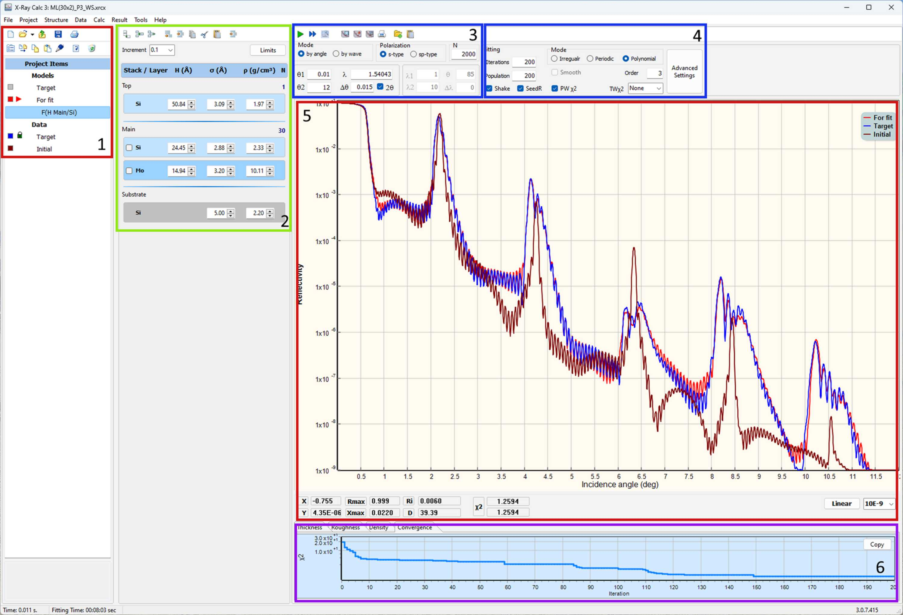

# X-Ray Calc 3 — User Manual

**Version 7 | Copyright 2001–2025 Oleksiy Penkov**

---

## Table of Contents

1. [Introduction](#1-introduction)
2. [Installation and First Launch](#2-installation-and-first-launch)
3. [Application Overview](#3-application-overview)
4. [Projects](#4-projects)
5. [Defining a Model](#5-defining-a-model)
6. [Experimental Data](#6-experimental-data)
7. [Calculation](#7-calculation)
8. [Fitting (Optimization)](#8-fitting-optimization)
9. [Results and Export](#9-results-and-export)
10. [Charts and Visualization](#10-charts-and-visualization)
11. [Profile Extensions](#11-profile-extensions)
12. [Tools](#12-tools)
13. [Application Settings](#13-application-settings)
14. [Keyboard Shortcuts and Quick Reference](#14-keyboard-shortcuts-and-quick-reference)
15. [File Formats](#15-file-formats)
16. [Troubleshooting](#16-troubleshooting)

---

## 1. Introduction

**X-Ray Calc 3** (XRC3) is an open-source software package for simulating X-ray reflectivity (XRR) and solving the inverse problem of reconstructing film structures from measured XRR curves. It is designed for researchers working with X-ray optics, synchrotron radiation, and thin-film coatings.

The software employs Parratt's exact recursive method based on the Fresnel equations to calculate XRR and incorporates specialized tools for modeling periodic multilayer structures (PMMs). Refractive indices of materials are computed using the Henke tables of atomic scattering factors (Henke *et al.*, 1993). The computational algorithm has been validated against the *IMD* software (Windt, 1998), with accumulated variances consistently below 0.5%.

The application allows you to:

- Build multilayer structural models composed of stacks and individual layers
- Calculate theoretical X-ray reflectivity curves as a function of incidence angle (theta) or wavelength (lambda)
- Load experimental reflectivity data and compare it with theoretical predictions
- Automatically fit model parameters to experimental data using the Shake LFPSO (Levy Flight Particle Swarm Optimization) algorithm
- Visualize results through interactive charts with logarithmic/linear scaling
- Define parameter profiles (polynomial, exponential, tabulated) across periodic structures
- Manage materials via the built-in Henke atomic form factor database

> **Reference:** Penkov, O. V., Li, M., Mikki, S., Devizenko, A. & Kopylets, I. (2024). *X-Ray Calc 3: improved software for simulation and inverse problem solving for X-ray reflectivity.* J. Appl. Cryst. **57**, 555-566. https://doi.org/10.1107/S1600576724001031

---

## 2. Installation and First Launch

### System Requirements

- Windows 10 or later (64-bit recommended)
- .NET Framework 4.0 (for MSBuild components)
- Minimum 4 GB RAM (8 GB recommended for large models)
- Multi-core CPU recommended for parallel computation

### Data Storage

On first launch, X-Ray Calc 3 creates a working directory:

- **Default location**: `%APPDATA%\X-RayCalc3\`
- **Portable mode**: If a file named `uselocaldata` exists in the application folder, all data is stored locally next to the executable.

The working directory contains:

| File/Folder | Purpose |
|---|---|
| `xrc3.ini` | Application settings |
| `Henke/` | Atomic form factor tables |
| `Backup/` | Auto-save and backup projects |
| `Output/` | Fitting results (when auto-save is enabled) |
| `Benchmark/` | Benchmark model files |
| `Jobs/` | Batch job definitions |

### File Association

To associate `.xrcx` project files with X-Ray Calc 3, go to **File > Settings > Paths and Files** and click **Register file associations (xrcx)**.

---

## 3. Application Overview

### Main Window Layout

The primary window comprises four key panels (see Figure 1 below). The first panel, **Project Items** (1), showcases the contents of the current project. A project can organize an unlimited number of theoretical models and experimental curves into well-structured folders. The **Structure panel** (2) functions as a visual depiction of the layered model and provides easy access to all parameters linked with the structural model. The right side contains **XRR calculation parameters** (3) and **Fitting parameters** (4) at the top, the main **XRR curve plot** (5) in the center, and **Distributions / Convergence charts** (6) at the bottom.


*Figure 1. Screenshot of the XRC3 GUI. (1) Project tree. (2) Structure panel. (3) XRR calculation parameters. (4) Fitting parameters. (5) XRR curves. (6) Distributions / Convergence panel. (From Penkov et al., 2024.)*

#### Left Column — Project Panel

- **File Toolbar**: New, Open, Reopen, Save, Print
- **Project Toolbar**: Add Model, Export, Copy, Paste, Edit Properties, Add Extension, Copy Image, Print, Delete
- **Project Tree**: Hierarchical view of all models, data sets, and folders in the current project
- **Description**: Read-only text memo showing the description of the selected item

#### Middle Column — Structure Panel

- **Structure Toolbar**: Stack operations (Add, Insert, Delete) and Layer operations (Add, Insert, Copy, Cut, Paste, Delete)
- **Increment Selector**: Step size for quick parameter adjustment (10, 5, 1, 0.25, 0.1, 0.01)
- **Set Fit Limits Button**: Opens the parameter bounds editor for fitting
- **Visual Structure Editor**: Interactive graphical representation of the layer structure — shows Ambient, Stacks (with N repetitions), individual Layers (with H, sigma, rho values), and Substrate. Double-click elements to edit properties; click parameter values for in-place editing.

#### Right Column — Working Area

- **Calculation Toolbar**: Load Data, Paste Data, Calculate, Save Result, Copy Result, Batch Execute, Auto Fit, Stop
- **Settings Panel**: Calculation mode and parameters (left) alongside Fitting mode and parameters (right)
- **Main Chart**: Interactive reflectivity plot (theta or lambda vs. reflectivity)
- **Chart Info Bar**: Cursor position, peak detection, area integration, chi-square values
- **Chart Pages**: Tabbed sub-charts for parameter distributions (Thickness, Roughness, Density, Profile, Fitting Progress)

#### Status Bar

Displays calculation time, fitting time, application version, and platform (x64).

### Menu Bar

| Menu | Purpose |
|---|---|
| **File** | Project management (New, Open, Save, Settings, Exit) |
| **Project** | Model operations (New Model, Duplicate, Copy, Paste, Add Folder) |
| **Structure** | Stack and layer editing (Add, Insert, Delete, Copy, Paste, Cut) |
| **Data** | Experimental data operations (Load, Paste, Normalize, Smooth, Trim, Export) |
| **Calc** | Calculation and fitting (Calculate, Calculate All, Auto Fitting, Batch Jobs, Benchmark) |
| **Result** | Export results (Save, Copy to Clipboard, Copy as BMP/WMF) |
| **Tools** | Material management (Create Material, Edit Henke Table) |
| **Help** | User Manual, About dialog |

---

## 4. Projects

### Project Files

Projects are saved as `.xrcx` files. Internally, an `.xrcx` file is a ZIP archive containing:

- `project.dsc` — project metadata
- `params.dsc` — model structure definitions
- Associated experimental data files

### Creating a New Project

1. Choose **File > New Project** (or click the **New** toolbar button).
2. An empty project is created with no models or data.

### Opening a Project

- **File > Open Project** — browse for a `.xrcx` file
- **File > Recent Projects** — select from up to 10 recently opened projects
- **Open toolbar button** — click the dropdown arrow for recent projects

### Saving a Project

- **File > Save Project** — save to the current file
- **File > Save Project As** — save with a new name/location

### Auto-Save

When enabled in Settings, the application periodically saves a backup to `AutoSave.xrcx` in the temp directory. This provides crash recovery — on next launch, you will be prompted to restore the auto-saved project.

### Project Locking

When a project is open, a lock file (`temp.lock`) prevents simultaneous access from another instance. The lock is released when the project is closed.

### Project Tree Organization

The project tree shows items in a hierarchy:

- **Model Group**: Contains all structural models
  - Individual models (each with its own layer structure and calculation parameters)
  - Extensions (profile functions attached to models)
- **Data Group**: Contains experimental data sets
- **Folders**: User-created organizational folders

Right-click the project tree for context menu operations.

---

## 5. Defining a Model

### Creating a Model

1. Choose **Project > New Model** or click the **Add Model** toolbar button.
2. A new model appears in the project tree with a default empty structure.

### Duplicating a Model

Select a model in the project tree and choose **Project > Duplicate Model** to create an exact copy, including all layers, stacks, and parameters.

### The Structure Editor

The structure editor is a visual panel in the lower-left area that displays the current model's layer structure. It shows:

- **Ambient** (top) — the medium above the structure (typically vacuum or air)
- **Stacks** — repeating periodic units containing one or more layers
- **Individual Layers** — single layers outside of stacks
- **Substrate** (bottom) — the base material

Each element in the structure is displayed as a colored block with its parameters.

### Stacks (Periods)

A stack represents a periodic multilayer structure — a group of layers repeated N times.

**Adding a stack:**
1. Select the model in the project tree.
2. Choose **Structure > Add Stack** or use the structure toolbar.
3. The Stack Properties dialog opens with:
   - **Stack name**: A label for the stack
   - **N**: Number of repetitions (periods)

**Editing a stack:**
Double-click the stack header in the structure editor to open the Stack Properties dialog.

### Layers

Each layer has three primary parameters:

| Parameter | Symbol | Unit | Description |
|---|---|---|---|
| Thickness | H | Angstrom (A) | Physical thickness of the layer |
| Roughness | sigma | Angstrom (A) | Interface roughness (RMS) |
| Density | rho | g/cm3 | Material density |

Additionally, each layer has a **material** assignment that links it to an entry in the Henke atomic form factor database.

**Adding a layer:**
1. Select a stack or model in the structure editor.
2. Choose **Structure > Add Layer** or use the toolbar.
3. The Layer Properties dialog opens with fields for:
   - **Layer material**: Select or type a chemical formula (e.g., "Si", "Mo", "SiO2")
   - **H (A)**: Thickness in Angstroms
   - **sigma (A)**: Roughness in Angstroms
   - **rho (g/cm3)**: Density in g/cm3

**Navigating layers:**
The Layer Properties dialog includes **<<** and **>>** buttons to move to the previous or next layer without closing the dialog.

**Layer operations** (via Structure menu or toolbar):
- **Insert Layer** — insert before the selected position
- **Copy Layer** — copy to internal clipboard
- **Paste Layer** — paste from internal clipboard
- **Cut Layer** — copy and delete
- **Delete Layer** — remove the layer

### Quick Parameter Editing

In the structure editor, you can adjust layer parameters directly:
- Click a parameter value to edit it in-place
- Use the **Increment** selector (in the structure toolbar) to set the step size for fine-tuning
- Changes are applied immediately; if Auto-Calc is enabled, the reflectivity recalculates in real time

### Undo

Choose **Structure > Undo Structure Changes** to revert the last structural modification.

### Model Text (JSON)

For advanced users, **Structure > Edit Model Text** opens a JSON editor showing the raw model definition. This allows direct text editing of the complete structure.

---

## 6. Experimental Data

### Loading Data from File

1. Select a model or data item in the project tree.
2. Choose **Data > Load from File** or click the **Load Data** toolbar button.
3. Browse for a text file containing two-column data (angle/wavelength and reflectivity).
4. The data appears as a series on the main chart.

### Pasting Data from Clipboard

1. Copy two-column data from another application (e.g., a spreadsheet).
2. Choose **Data > Paste from Clipboard** or click the **Paste Data** toolbar button.
3. The data is imported into the current model.

### Data Format

The expected data format is a simple two-column text file:
```
<angle_or_wavelength>   <reflectivity>
```

Values can be separated by tabs or spaces. Lines starting with `#` or other non-numeric characters are treated as comments and ignored.

Example:
```
0.100   1.000000
0.200   0.999850
0.300   0.998200
0.500   0.956300
1.000   0.523100
2.000   0.012450
5.000   0.000023
```

### Data Processing

After loading data, several processing operations are available:

#### Normalize

**Data > Normalize** opens a dialog where you can manually set the normalization factor. This scales the reflectivity values so the maximum equals 1.0 (or another chosen value).

**Data > Normalize (Auto)** automatically normalizes the data by dividing all reflectivity values by the maximum value.

#### Smooth

**Data > Smooth** applies a Savitzky-Golay smoothing filter to reduce noise in the experimental data while preserving peak shapes.

#### Trim

**Data > Trim** removes the low-reflectivity tail of the data (values below a threshold), which can improve fitting convergence by eliminating noisy data points at high angles.

### Exporting Data

- **Data > Copy to Clipboard** — copy data in tab-separated format for pasting into other applications
- **Data > Export to File** — save processed data to a text file

---

## 7. Calculation

### Calculation Modes

X-Ray Calc 3 supports two calculation modes:

#### Theta Mode (by angle)

Calculates reflectivity as a function of incidence angle at a fixed wavelength.

Parameters:
- **theta1**: Start angle (degrees)
- **theta2**: End angle (degrees)
- **lambda (A)**: Fixed wavelength in Angstroms (default: 1.54043 A, Cu K-alpha)
- **d-theta**: Angular resolution/step size (degrees)
- **2-theta**: When checked, angles are in 2-theta (double angle) convention

#### Lambda Mode (by wavelength)

Calculates reflectivity as a function of wavelength at a fixed incidence angle.

Parameters:
- **lambda1**: Start wavelength (Angstroms)
- **lambda2**: End wavelength (Angstroms)
- **theta**: Fixed incidence angle (degrees)
- **d-lambda**: Wavelength step size (Angstroms)

### Polarization

Two polarization modes are available:

- **s-type**: S-polarization (TE mode, electric field perpendicular to the plane of incidence)
- **sp-type**: Mixed sigma/pi polarization

### Number of Points (N)

The **N** parameter controls the number of calculation points (default: 2000). More points give smoother curves but take longer to compute.

### Running a Calculation

1. Select a model in the project tree.
2. Set the calculation parameters (mode, angle/wavelength range, polarization, N).
3. Choose **Calc > Calculate** or click the **Calc Run** toolbar button.
4. The calculated reflectivity curve appears on the main chart.

**Calculate All** (**Calc > Calculate All**) calculates reflectivity for every model in the project.

### Auto-Calculation

When **Auto-Calc** is enabled (in Settings), the reflectivity is recalculated automatically whenever you modify the structure. This provides real-time feedback as you adjust layer parameters.

### Multi-Threading

Calculations use multi-threaded parallelism for performance. Configure the number of CPU cores in **File > Settings > Calc & Fit**:

- **Auto (Use all)** — use all available CPU cores (default)
- **2, 4, 8, 12, 16, 32, 64** — limit to a specific number of threads

---

## 8. Fitting (Optimization)

Fitting adjusts model parameters to minimize the difference between calculated and experimental reflectivity curves. X-Ray Calc 3 uses the **LFPSO (Levy Flight Particle Swarm Optimization)** algorithm — a population-based global optimization method.

### Prerequisites for Fitting

Before starting a fit, you need:

1. **A defined model** with initial parameter estimates
2. **Experimental data** loaded into the project
3. **Fit limits** set for each adjustable parameter

### Setting Fit Limits

1. Select the model in the project tree.
2. Click the **Set Fit Limits** button in the structure toolbar, or choose **Structure > Set Fit Limits**.
3. The Limits dialog opens, showing a table of all layer parameters (H, sigma, rho) with columns for:
   - **Min**: Lower bound for fitting
   - **Max**: Upper bound for fitting
4. Only parameters with Min != Max will be adjusted during fitting. Set Min = Max to fix a parameter.

### Fitting Modes

Three fitting modes are available, selected in the **Fitting** panel:

#### Irregular Mode

Each layer's parameters (H, sigma, rho) are treated as independent variables. This is the most flexible mode — suitable for structures without strict periodicity.

- Each layer has its own fitted thickness, roughness, and density.
- The **Smoothing window** parameter (in Advanced Settings) applies spatial smoothing to prevent unphysical oscillations in fitted parameters.

#### Periodic Mode

Layer parameters vary periodically across the stack. This mode is appropriate for periodic multilayer structures where parameters drift gradually with depth.

- Parameters are fitted per-layer within one period, then applied to all periods.
- Suitable for structures with consistent periodicity.

#### Polynomial Mode

Parameter variations are described by polynomial functions of depth. This is the most constrained mode — it fits polynomial coefficients rather than individual layer values.

- **Order**: Maximum polynomial order (1 = linear, 2 = quadratic, etc.)
- Useful for smooth, continuous parameter gradients.

### Basic Fitting Parameters

These are set in the **Fitting** panel on the main window:

| Parameter | Description | Default |
|---|---|---|
| **Iterations** | Maximum number of optimization iterations | 100 |
| **Population** | Number of particles (candidate solutions) in the swarm | 100 |
| **Shake** | Enable random perturbation to escape local minima | Checked |
| **SeedR** | Seed particles from the parameter range | Checked |
| **Smooth** | Apply smoothing to fitted parameter profiles | Unchecked |
| **PW chi2** | Point-weighted chi-square calculation | Checked |
| **TW chi2** | Theta-weighted chi-square function | None |

#### Theta-Weighted Chi-Square (TW chi2)

Controls how the chi-square metric weights different angular regions:

| Option | Effect |
|---|---|
| None | Equal weight across all angles |
| sqr | Weight proportional to theta^2 (emphasizes high angles) |
| line | Weight proportional to theta |
| sqrt | Weight proportional to sqrt(theta) |
| 1/sqr | Weight proportional to 1/theta^2 (emphasizes low angles) |
| 1/sqrt | Weight proportional to 1/sqrt(theta) |

### Advanced Fitting Settings

Click the **Advanced Settings** button in the Fitting panel to open the detailed LFPSO configuration dialog.

#### General

| Parameter | Description | Default |
|---|---|---|
| **Tolerance** | Target cost function value; fitting stops when reached | 0.005 |

#### LFPSO Parameters

| Parameter | Description | Default |
|---|---|---|
| **SHmax** | Maximum number of consecutive shakes | 3 |
| **Jmax** | Number of iterations without improvement before shake | 1 |
| **Vmax** | Maximum particle velocity factor | 0.3 |
| **omega1** | Velocity scale factor (permanent component) | 0.3 |
| **omega2** | Velocity reducing factor | 0.1 |
| **k1** | Velocity shake coefficient | 1.41 |
| **k2** | Best cost function shake coefficient | 1.41 |

#### Irregular Mode Settings

| Parameter | Description | Default |
|---|---|---|
| **Smoothing window** | Width of the smoothing window (set -1 for automatic) | 3 |

#### Polynomial Mode Settings

| Parameter | Description | Default |
|---|---|---|
| **Polynomial factor** | Scale factor for polynomial parameter space | 10 |
| **Ksxr** | Velocity scale factor for polynomial coefficients | 0.2 |

### Running a Fit

1. Ensure a model with experimental data and fit limits is selected.
2. Configure fitting mode and parameters.
3. Choose **Calc > Auto Fitting** or click the **Fast Forward** toolbar button.
4. The fitting process begins:
   - The main chart updates in real time, showing the best-fit curve converging toward the experimental data.
   - The **Fitting Progress** chart page shows the chi-square convergence curve.
   - The status bar displays elapsed fitting time.
   - If **Live Update** is enabled (in Settings), the structure editor updates to show current best-fit parameters.
5. Fitting stops when:
   - The maximum number of iterations is reached, OR
   - The tolerance threshold is met, OR
   - You click the **Stop** button.

### Understanding Chi-Square

The chi-square (chi2) value measures the goodness of fit:

- **Lower is better** — chi2 = 0 means a perfect fit
- Displayed in the Chart Info bar as both current and best values
- The fitting algorithm minimizes chi2 by adjusting model parameters within the specified limits
- Calculated on a logarithmic scale to give equal weight to both high and low reflectivity regions

---

## 9. Results and Export

### Saving Results

**Result > Save Results** saves the calculated reflectivity data to a text file with columns for angle/wavelength and reflectivity.

### Copying to Clipboard

- **Result > Copy to Clipboard** — copy reflectivity data as tab-separated text
- **Result > Copy as BMP** — copy the chart as a bitmap image
- **Result > Copy as WMF** — copy the chart as a Windows Metafile (vector format, suitable for publications)

### Saving the Plot

**Result > Save Plot as File** saves the chart as an image file.

### Structure Image

**Structure > Copy as Image** copies the visual structure diagram (the layer/stack representation) to the clipboard as an image.

### Auto-Save Results

When enabled in Settings (**Automatically save results to output folder after fitting**), fitting results are automatically saved to the configured Output directory after each fitting run completes.

---

## 10. Charts and Visualization

### Main Reflectivity Chart

The large chart in the working area displays:

- **Calculated reflectivity curves** (one per model, color-coded)
- **Experimental data** (if loaded)
- **Best-fit curve** (during and after fitting)

#### Interaction

- **Zoom**: Click and drag to select a zoom region
- **Pan**: Right-click and drag to pan
- **Reset zoom**: Double-click to reset to full view
- **Scale toggle**: Click the **Scale** button to switch between linear and logarithmic Y-axis
- **Min limit**: Set a cutoff threshold — reflectivity values below this limit are clipped

#### Cursor Tracking

The Chart Info bar shows the current cursor position (X, Y coordinates) as you move the mouse over the chart.

### Chart Pages

Below the main chart are tabbed sub-charts:

#### Thickness (H)

Bar chart showing the thickness of each layer in the structure. After fitting, this shows how layer thicknesses vary across the structure.

#### Roughness (sigma)

Bar chart showing the interface roughness of each layer. Useful for identifying roughness trends in periodic structures.

#### Density (rho)

Bar chart showing the density of each layer, with the applied density profile overlaid.

#### Profile

Electron density (or refractive index) profile as a function of depth into the structure. This gives a physical picture of the complete multilayer structure.

#### Fitting Progress

During fitting, this chart shows the chi-square value vs. iteration number. Use this to monitor convergence:

- A steadily decreasing curve indicates good convergence
- Plateaus may indicate local minima (shake/re-initialization helps escape these)
- Sudden jumps up indicate a shake event

### Peak Analysis

The Chart Info bar includes peak detection and analysis:

- **Peak Max**: Maximum reflectivity value and its position
- **Area**: Integrated area under the peak (useful for quantitative analysis)
- **Period**: Estimated multilayer period from peak spacing

---

## 11. Profile Extensions

Profile extensions allow you to define how layer parameters (H, sigma, rho) vary across a periodic structure. They model parameter gradients — for example, when layer thickness gradually increases or density changes with depth.

### Adding a Profile Extension

1. Select a model in the project tree.
2. Click the **Add Extension** toolbar button or choose the extension option from the project toolbar.
3. The Extension Type Selector dialog opens with available profile types.

### Profile Types

#### Function Profile

Defines parameter variation using an analytical function:

| Function | Formula | Use Case |
|---|---|---|
| **Polynomial** | a0 + a1*x + a2*x^2 + ... | General-purpose gradient |
| **Exponential** | a0 * exp(a1*x) | Exponential growth/decay |
| **Parabolic** | a0 + a1*x^2 | Symmetric variation |
| **SQRT** | a0 + a1*sqrt(x) | Gradual initial change |

The Profile Function editor lets you set the coefficients and preview the resulting profile.

#### Table Profile

Defines parameter variation as a set of (position, value) data points. The application interpolates between points. This allows arbitrary profile shapes that cannot be described by simple functions.

The Profile Table editor provides a grid where you enter depth positions and corresponding parameter values.

### Enabling/Disabling Extensions

Each extension can be individually enabled or disabled without deleting it. This lets you quickly compare results with and without a particular profile applied.

---

## 12. Tools

### Create New Material

**Tools > Create New Material** opens a dialog to add a custom material to the Henke database.

Enter the chemical formula and the application calculates the atomic form factors from the constituent elements. This is useful for compounds not already in the database.

### Edit Henke Table

**Tools > Edit Henke Table** opens the Henke Table Editor, which allows you to view and modify the atomic scattering factor tables used for reflectivity calculations.

The Henke tables contain wavelength-dependent atomic form factors (f1, f2) for each element. These are the fundamental optical constants used in the Fresnel equation calculations.

### Benchmark

**Calc > Benchmark** opens the Benchmark dialog, which measures the calculation performance of your system:

- Runs a standard reflectivity calculation multiple times
- Reports average execution time
- Useful for comparing performance across different hardware or thread configurations

Configure the number of benchmark runs in **File > Settings > Calc & Fit**.

---

## 13. Application Settings

Access settings via **File > Settings**. The Settings dialog has five sections, navigated via the tree on the left.

### Paths and Files

Configure directory locations:

| Setting | Description |
|---|---|
| **Default Project's Folder** | Where new projects are saved by default |
| **Work Folder** | Base directory for all application data |
| **Henke Library** | Location of Henke atomic form factor tables |
| **Jobs** | Directory for batch job definitions |
| **Benchmark output** | Where benchmark results are saved |
| **Benchmark** | Location of benchmark model files |
| **Fitting Output** | Where fitting results are auto-saved |

**Register file associations (xrcx)** — associates `.xrcx` files with X-Ray Calc 3 in Windows.

### Behavior

| Setting | Description | Default |
|---|---|---|
| **Automatically calculate when opening project** | Run calculation on all models when a project is opened | On |
| **Live update structure panel during fitting** | Show real-time parameter changes in the structure editor during fitting | Off |
| **Automatically save results to output folder after fitting** | Save fitting results to the Output directory automatically | Off |
| **Automatically check for updates** | Check for new versions on launch | Off |

### Interface

Interface customization settings (reserved for future options).

### Calc & Fit

| Setting | Description | Default |
|---|---|---|
| **Number of CPU cores to use** | Thread count for parallel computation | Auto (Use all) |
| **Number of runs** (Benchmark) | How many benchmark iterations to perform | 10 |

### Graphics

| Setting | Description | Default |
|---|---|---|
| **Default line width** | Width of chart series lines in pixels | 2 |

---

## 14. Keyboard Shortcuts and Quick Reference

### Toolbar Quick Reference

| Button | Action |
|---|---|
| New | Create a new project |
| Open | Open an existing project |
| Save | Save the current project |
| Print | Print the current chart |
| Add Model | Add a new model to the project |
| Load Data | Load experimental data from file |
| Paste Data | Paste experimental data from clipboard |
| Calc Run | Calculate the selected model |
| Stop | Abort the current calculation or fitting |
| Fast Forward | Start auto-fitting |
| Result Save | Save calculation results to file |
| Copy Result | Copy results to clipboard |
| Scale | Toggle linear/logarithmic chart scale |
| Delete | Remove the selected item |

### Structure Toolbar

| Button | Action |
|---|---|
| Period + | Add a new stack |
| Period Insert | Insert a stack at the current position |
| Period - | Delete the selected stack |
| Layer + | Add a new layer |
| Layer Insert | Insert a layer at the current position |
| Layer Copy | Copy the selected layer |
| Layer Cut | Cut the selected layer |
| Layer Paste | Paste the copied layer |
| Layer - | Delete the selected layer |
| Set Fit Limits | Open the parameter bounds editor |
| Increment | Set the step size for parameter adjustments |

---

## 15. File Formats

### Project File (.xrcx)

A ZIP archive containing:

- `project.dsc` — project metadata (title, descriptions)
- `params.dsc` — complete model definitions in text format (layers, stacks, parameters, calculation settings)
- Embedded experimental data files

### Experimental Data Files

Plain text, two columns separated by tabs or spaces:

```
# Optional comment lines starting with #
0.100   1.000000
0.200   0.999850
...
```

Column 1: Angle (degrees) or wavelength (Angstroms)
Column 2: Reflectivity (typically 0 to 1)

### Henke Tables

Binary or text files in the `Henke/` directory containing wavelength-dependent atomic form factors (f1, f2) for each element. These files are required for reflectivity calculations and are included with the application.

### Settings File (xrc3.ini)

Standard Windows INI file format. Sections include:

- `[Path]` — directory paths
- `[Window]` — window position and size
- `[Options]` — behavior flags
- `[Graphics]` — chart display settings
- `[Calc]` — calculation settings

---

## 16. Troubleshooting

### The application shows a "project locked" message

Another instance of X-Ray Calc 3 may have the project open, or a previous session crashed without releasing the lock. Close the other instance, or manually delete the `temp.lock` file from the temp directory (`%TEMP%\X-RayCalc3\`).

### Fitting does not converge

- **Widen the fit limits** — the initial parameter bounds may be too narrow to contain the true solution.
- **Increase population size** — more particles explore the parameter space more thoroughly.
- **Increase iterations** — the algorithm may need more time to converge.
- **Enable Shake** — this helps escape local minima.
- **Check initial model** — a better starting guess leads to faster convergence.
- **Try a different fitting mode** — Periodic mode may work better than Irregular for regular multilayers, and vice versa.

### Calculation is slow

- Ensure multi-threading is enabled (**Settings > Calc & Fit > Auto (Use all)**).
- Reduce the number of calculation points (N) for preliminary calculations.
- Use the 64-bit version for better performance with large models.

### Material not found

If a material name is not recognized:
- Check the spelling (chemical formula must be exact, e.g., "SiO2" not "Sio2").
- The material may not exist in the Henke database. Use **Tools > Create New Material** to add it.

### Chart appears empty after calculation

- Check that the angle/wavelength range is appropriate for the structure.
- For very thin films, use small angles (0.01 to 5 degrees).
- Switch between linear and logarithmic scale — the reflectivity may be visible only on one scale.
- Verify that the model has at least one layer defined.

### Data import fails

- Ensure the data file is plain text with two numeric columns.
- Remove any header lines that are not prefixed with `#`.
- Check that decimal separators match your system locale (period vs. comma).
- Try pasting the data via clipboard instead.

---

*X-Ray Calc 3 — Oleksiy Penkov — oleksiypenkov@intl.zju.edu.cn*
